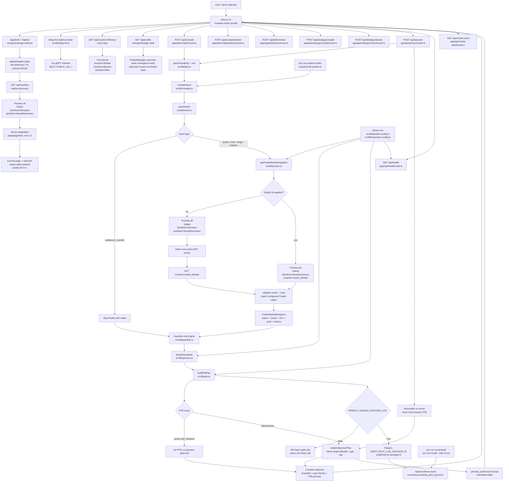

# DeepPilot RiskOps

DeepPilot is a DeepBook Predict execution and risk cockpit for Sui Overflow 2026.

The app turns a constrained trading intent into:

- a live DeepBook Predict market snapshot from `predict-server.testnet.mystenlabs.com`
- a deterministic Guardian decision (`allow`, `reduce`, or `block`)
- an auditable Predict PTB preview
- a sponsor-policy preview for testnet demo flows

## Current Progress (2026-06-17)

- Completed
  - `/api/markets` + `/api/oracles/:id/history` for live discovery and chart/history.
  - `/api/compile` + `/api/compile/stream` for intent compilation and stream events.
  - `/api/pilot/stream` mode routing (`chat / trade / strategy`).
  - `/api/strategy/compile` + `/api/strategy/stream` for strategy planning.
  - `/api/review-seed` replay decode and terminal receipt persistence.
  - Wallet-signed execution path in terminal for PredictManager create, single mint, and strategy batch mint.
- In progress
  - `/api/sponsor` remains preview-only (`preview_authorized`) without dual-sign sponsor submit.
  - Keeper remains UI-level guidance/status for now; no dedicated background keeper daemon yet.

## Current Scope

This repository targets DeepBook Predict testnet. It does not pretend to expose a traditional CLOB order book. The risk model uses official Predict primitives:

- Predict server health and pipeline lag
- active BTC oracle state
- latest spot, forward, and SVI data
- oracle freshness and expiry
- vault liquidity, utilization, and max-payout utilization
- ask-bounds when available, with an explicit fallback when the endpoint returns `null`

## Product Routes

- `/markets` discovers live BTC Predict oracles, filters by status, expiry, and Guardian quick risk, paginates the result set, caches discovery in client context, and only prefetches full oracle state for the current page plus the selected market.
- `/trade` is the operational terminal: chat/trade/strategy routing, Guardian review, and execution review/sign path.
- `/profile` shows wallet status, PredictManager linkage, and browser-local execution/preview receipts. It does not invent positions or PnL when a manager is not linked.

## How It Works



Key boundaries:

- `/api/compile` is the read and planning path. It returns a live Predict snapshot, Guardian result, sponsor-policy decision, and PTB preview.
- `/api/compile/stream` is the fast stream path. It returns compiler stage events and the same compiled review payload.
- `/api/pilot/stream` routes user input into `chat`, `trade`, or `strategy` mode and returns either strategy/trade compilation or chat answers.
- `/api/strategy/compile` and `/api/strategy/stream` are the strategy planning endpoints and stream equivalents.
- `/api/review-seed` decodes signed review replay tokens.
- `/api/markets` is the discovery path. It returns one page at a time and does not fetch full state for every oracle; it prefetches current-page rows plus the selected oracle only.
- `/api/oracles/:id/history` returns bounded, normalized chart data so browser components do not query Predict history directly.
- `/api/profile` returns honest manager linkage state. Missing manager data stays empty instead of fabricating PnL.
- `/api/sponsor` recompiles on the server before producing a preview receipt. It does not trust a PTB returned to the browser.
- `MarketDataProvider` keeps `/markets` results in a short-lived client cache. It avoids per-render polling and leaves fast price ticks to explicit refresh or selected-oracle history reads.
- `quote-only` intents stop after market and Guardian review. They never build a mint PTB and never receive sponsor approval.
- `Buy` maps to Predict mint preview. `Sell` maps to redeem/close preview because this demo does not pretend to have a secondary market or order book.
- Real submission path is split:
  - Wallet execution is implemented in UI for supported actions (`create manager`, single mint, strategy batch mint) and returns on-chain receipts.
  - `/api/sponsor` remains preview-only and does not perform a full dual-sign sponsor submit flow.

The frontend is a three-page product surface rather than a generic chat app. `/markets` is for discovery, `/trade` is the execution workbench, and `/profile` is wallet/receipt/manager state. `components/deep-pilot-terminal.tsx` owns the ticket, intent textarea, market cards, Guardian panel, PTB preview, gas policy checks, and execution receipt panel. It calls `/api/compile` when the user edits or runs an intent, and calls `/api/sponsor` only after a PTB exists and Guardian has not blocked it. Wallet state is browser-only through DApp Kit; the public RPC URLs use `NEXT_PUBLIC_*` because they are safe to ship to the client.

The backend is deliberately split into small modules. `src/lib/intent.ts` calls DeepSeek `deepseek-v4-flash` from the server only, streams JSON-mode output, validates it with zod, and falls back to a local constrained parser if DeepSeek is unavailable. `src/lib/predict.ts` is the only DeepBook Predict public API reader. `src/lib/guardian.ts` turns live market state into `allow`, `reduce`, or `block`. `src/lib/pilot.ts` handles chat/trade/strategy intent routing. `src/lib/strategy.ts` builds strategy plans. `src/lib/ptb.ts` builds an auditable PTB preview with exact Move targets, while `src/lib/sponsor.ts` validates gas policy, package allowlists, Move call allowlists, and gas budget. `src/lib/compile.ts` is the orchestrator that wires these pieces together.

Request flow is kept tight. A normal "next active oracle" trade needs three parallel Predict reads first, then one selected oracle-state read. If the user already supplies an oracle id, the app skips the full oracle-list read and performs the remaining three reads in parallel. Market discovery uses a 20 second client TTL plus manual refresh, not a high-frequency ticker. After direct oracle lookup, the app still checks that the oracle and vault belong to the configured Predict object, so the optimization does not weaken protocol safety.

Environment configuration is split by exposure. `NEXT_PUBLIC_*` values are only for wallet/network client config. Predict package ids, Predict object ids, preview accounts, sponsor limits, and audit-log package ids use normal server-side env names because they are read by API routes and server-side scripts. There is no `NEXT_PRIVATE_*` convention in Next.js; the rule is simply that anything without `NEXT_PUBLIC_` is not bundled into the browser unless the app sends it there.

Gas usage is intentionally conservative. By default `PREDICT_ENABLE_ONCHAIN_LOG=false`, so PTB previews do not add the extra `deep_pilot_log` Move call. If on-chain audit is enabled, `DEEP_PILOT_LOG_PACKAGE_ID` must be a published `0x...` package id; otherwise compile returns a Guardian `CONFIG_ERROR` block instead of creating a misleading PTB.

The current product boundary is also explicit: the product has wallet-signable execution paths, while `/api/sponsor` remains a preview/validation path without server-side sponsor dual-sign submit.

## Commands

```bash
bun install
bun run typecheck
bun run lint
bun run build
bun run pilot:smoke
bun run predict:smoke
bun run move:build
bun run dev
bun run sui:testnet-key
```

## Environment

Copy `.env.example` to `.env.local` for local development. In Vercel, add the same keys in Project Settings -> Environment Variables.

Use `NEXT_PUBLIC_` only for browser-side wallet/RPC config:

- `NEXT_PUBLIC_SUI_NETWORK`
- `NEXT_PUBLIC_SUI_TESTNET_GRPC_URL`
- `NEXT_PUBLIC_SUI_DEVNET_GRPC_URL`

Use normal server-side env names for DeepBook Predict deployment IDs and package IDs:

- `PREDICT_SERVER_URL`
- `PREDICT_NETWORK`
- `PREDICT_PACKAGE_ID`
- `PREDICT_OBJECT_ID`
- `PREDICT_DUSDC_TYPE`
- `PREDICT_PLP_COIN_TYPE`
- `PREDICT_SOURCE_BRANCH`
- `PREDICT_ENABLE_ONCHAIN_LOG`
- `PREDICT_PREVIEW_SENDER`
- `PREDICT_PREVIEW_SPONSOR`
- `PREDICT_PREVIEW_MANAGER`
- `DEEP_PILOT_LOG_PACKAGE_ID`
- `REVIEW_SEED_SECRET`
- `SPONSOR_MAX_GAS_BUDGET`
- `SPONSOR_MAX_TRADE_SIZE_DUSDC`
- `DEEPSEEK_API_KEY`
- `DEEPSEEK_MODEL`

Next.js does not need a `NEXT_PRIVATE_` prefix. Anything without `NEXT_PUBLIC_` stays server-side unless you manually send it to the client.


`PREDICT_ENABLE_ONCHAIN_LOG=false` is the default gas-optimized mode. Set it to `true` only for demos that need an extra on-chain audit event.

## Request Strategy

`/api/compile` batches independent Predict reads with `Promise.all`. A free-form "next active oracle" intent needs `/status`, `/oracles`, `/vault/summary`, then one selected `/oracles/:id/state` read. If the intent already includes an oracle id, DeepPilot skips the full oracle list and reads `/status`, `/vault/summary`, and `/oracles/:id/state` in parallel, then validates that the oracle and vault belong to the configured Predict object.

`/api/markets` is optimized for discovery, not tick-by-tick trading. It reads `/status`, `/predicts/:id/oracles`, and `/vault/summary` in parallel, applies status/expiry pagination, then fetches state only for the selected oracle plus the visible page. `pageSize` defaults to 4 and is capped at 12. `components/market-data-provider.tsx` caches each market query for 20 seconds and exposes manual refresh. This rejects the obvious N+1 trap without pretending the market list is a streaming index. Quick risk filtering is page-scoped for the same reason: full risk filtering across every oracle would require a full state scan.

## Important Files

- `.env.example` - Vercel/local deployment configuration template
- `src/lib/predict.ts` - DeepBook Predict public API client and snapshot builder
- `src/lib/profile.ts` - PredictManager linkage/profile summary reader
- `src/lib/predict-config.ts` - server-side Predict deployment config
- `src/lib/client-config.ts` - browser-safe wallet/RPC config
- `src/lib/intent.ts` - deterministic Predict intent parser
- `src/lib/guardian.ts` - pre-sign risk policy
- `src/lib/ptb.ts` - auditable Predict PTB preview
- `src/lib/sponsor.ts` - sponsor gas policy, Move target allowlist, gas budget guard
- `components/markets-page.tsx` - market discovery UI
- `components/market-data-provider.tsx` - client market discovery cache and refresh cadence
- `components/deep-pilot-terminal.tsx` - trade workspace UI
- `components/profile-page.tsx` - profile and receipt UI
- `src/lib/pilot.ts` - chat/trade/strategy intent router
- `src/lib/strategy.ts` - strategy plan builder
- `src/lib/compile.ts` - compile orchestration pipeline
- `src/lib/receipts.ts` - browser-local preview/receipt persistence
- `app/api/compile/route.ts` - intent compile entry
- `app/api/compile/stream/route.ts` - compile stream entry
- `app/api/pilot/stream/route.ts` - unified pilot route for chat/trade/strategy
- `app/api/strategy/compile/route.ts` - strategy compile entry
- `app/api/strategy/stream/route.ts` - strategy stream entry
- `app/api/review-seed/route.ts` - review-seed replay decoding endpoint
- `app/api/sponsor/route.ts` - sponsor preview/authorization endpoint
- `app/api/markets/route.ts` - market discovery endpoint
- `app/api/oracles/[oracleId]/history/route.ts` - oracle history endpoint
- `app/api/profile/route.ts` - wallet linkage/profile endpoint
- `app/api/health/route.ts` - runtime health endpoint
- `final_proposal.md` - final track proposal and risk review
- `docs/archive/` - original research drafts kept for traceability

## Demo Intent

```text
Buy 10 DUSDC BTC UP near 62500 on the next active DeepBook Predict oracle
```

Wallet-signed execution is supported for configured manager/mint flows. The sponsor endpoint still only provides preview authorization and does not perform dual-sign sponsor submission.
