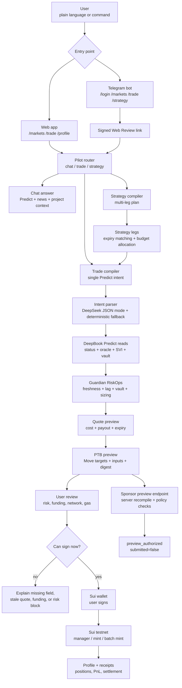

# DeepPilot

[中文说明](./README.zh-CN.md)

DeepPilot is an AI RiskOps cockpit for DeepBook Predict. It helps a user go from a plain-language idea such as "Bet 10 DUSDC that BTC will be down by tonight" to a live market review, risk checks, wallet-ready transaction preview, and final wallet signing path.

It is built for people who are new to prediction markets as well as operators who need a safer review flow before signing. The product does not ask users to understand every Predict object, oracle window, quote expiry, Trading Balance rule, or gas condition upfront. It turns those protocol details into a guided review.

## Why DeepPilot Exists

Prediction markets are powerful, but the first trade is hard. A new user has to answer several questions before they can act:

- Which BTC prediction market is active now?
- Which expiry should I use?
- Is the oracle fresh, or is the market already stale?
- How much DUSDC will the position cost?
- Is there enough Trading Balance in the PredictManager?
- Will the wallet be on the right Sui network with enough gas?
- Is this a single trade, a redeem action, or a multi-leg strategy?

DeepPilot was created to remove that operational burden. The user can start with natural language in Web or Telegram, while DeepPilot converts the request into a constrained Predict review, fetches live market data, runs deterministic risk checks, and only then opens a wallet signing path when the review is still valid.

## What It Solves

DeepPilot solves three practical problems:

- Onboarding friction: users can ask in natural language instead of manually assembling oracle ids, expiry choices, market keys, and transaction details.
- Pre-sign risk: every trade or strategy is checked against live Predict server status, oracle freshness, vault utilization, quote availability, Trading Balance, wallet network, and gas readiness before signing.
- Cross-channel handoff: a user can begin in Telegram, receive a Review & Sign link, and continue in the Web app where the quote and risk checks are refreshed before wallet confirmation.

## What Users Can Do

- Discover live BTC Predict markets in `/markets`, with expiry filters, quick risk labels, vault context, and chart history.
- Ask market questions in `/trade`; DeepPilot can answer with retrieved Predict/news/project context instead of forcing every message into a transaction.
- Place single-trade intents in plain language, for example: `Buy 10 DUSDC BTC UP on the next active market`.
- Draft multi-leg strategies in plain language, for example: `Split 20 DUSDC across the next 1h, 2h, and 3h BTC UP markets`.
- Review Guardian results before signing: `allow`, `reduce`, or `block`, with the reason shown to the user.
- Create or link a PredictManager, check Trading Balance, and sign wallet transactions for supported execution flows.
- Use Telegram commands such as `/login`, `/markets`, `/news BTC`, `/trade ...`, and `/strategy ...` to start from chat and finish in Web review.
- Track local receipts, manager state, Trading Balance, positions, PnL, settlement status, and redeem/funding actions in `/profile`.

## User Benefit

For a first-time prediction-market user, DeepPilot changes the experience from "learn the protocol first" to "describe what you want, then review the generated plan." The user still makes the trading decision and still controls the wallet signature, but the confusing parts of the protocol are surfaced as readable checks.

For a more experienced user, DeepPilot reduces repeated operational work: market discovery, quote refresh, strategy leg construction, wallet preflight, and receipt tracking are all placed in one workflow.

## Current Product Scope

| Area | Implemented | Boundary |
| --- | --- | --- |
| Market discovery | Live BTC DeepBook Predict markets, expiry filters, chart/history, page-scoped risk labels | It does not expose a traditional CLOB order book. |
| Natural-language trade | Web and Telegram input routed into `chat`, `trade`, or `strategy` modes | AI output is validated and may fall back to deterministic parsing. |
| Trade review | Live Predict snapshot, Guardian result, quote preview, PTB preview, funding checks | Quote-only intents do not build a transaction. |
| Strategy review | Deterministic multi-leg strategy plan, per-leg compile, aggregate funding check, batch transaction preview | Strategy output is a candidate plan, not investment advice. |
| Wallet execution | Create PredictManager, single binary mint, and selected strategy batch mint through the user's wallet | Wallet signing is user-controlled. |
| Sponsor endpoint | Challenge + wallet authorization + server-side recompile + policy preview receipt | `/api/sponsor` is preview-only. It returns `submitted: false` and does not do dual-sign sponsor submission. |
| Telegram handoff | Login/link flow, quota checks, market/news/trade/strategy commands, signed Web Review links | Execution still happens in Web with wallet confirmation. |
| Profile | Manager linkage, Trading Balance, positions, PnL, settlement/redeem/funding UI, local receipts | Missing manager data stays empty instead of inventing positions or PnL. |

## Technical Flow



### Flow in Plain English

1. The user starts in Web or Telegram with a question, trade request, or strategy request.
2. The pilot router classifies the input as chat, trade, or strategy.
3. Trade and strategy requests are converted into constrained Predict intents. LLM output is treated as untrusted and validated; deterministic fallback keeps the demo usable without an LLM key.
4. DeepPilot reads live DeepBook Predict status, active BTC oracles, oracle state, SVI data, and vault summary.
5. Guardian checks whether the review is safe enough to continue, should be reduced, or must be blocked.
6. If the action needs a position, DeepPilot requests a quote and builds a PTB preview with exact Move targets and inputs.
7. Before signing, the Web app refreshes quote-sensitive details and checks wallet network, SUI gas, PredictManager, and Trading Balance.
8. Supported actions can be signed by the user's wallet. Sponsor authorization remains a preview path only.
9. `/profile` keeps manager state, receipts, positions, PnL, funding, withdrawal, redeem, and settlement context visible after review.

## Main Routes

- `/landing` - public product page for judges and users.
- `/markets` - live BTC Predict market discovery and chart inspection.
- `/trade` - natural-language chat, trade review, strategy review, and wallet signing workspace.
- `/profile` - wallet profile, PredictManager state, Trading Balance, positions, receipts, and settlement actions.
- `/telegram/login` - wallet-link and Profile NFT onboarding for Telegram users.

## API Surface

- `POST /api/pilot/stream` - unified streaming endpoint for chat, trade, and strategy input.
- `POST /api/compile` - compiles a single Predict intent into market, Guardian, quote, gas, and PTB review.
- `POST /api/compile/stream` - streaming version of the single-trade compile flow.
- `POST /api/strategy/compile` - compiles a multi-leg strategy review.
- `POST /api/strategy/stream` - streaming version of the strategy review flow.
- `GET /api/markets` - paginated market discovery.
- `GET /api/oracles/:id/history` - bounded chart/history data for a selected oracle.
- `GET /api/profile` - wallet and PredictManager summary.
- `GET /api/review-seed` - decodes Telegram/Web Review replay tokens.
- `GET /api/sponsor` and `POST /api/sponsor` - sponsor challenge and preview authorization.
- `GET /api/health` - runtime health check.

## Implementation Notes

- `src/lib/pilot.ts` classifies user input into `chat`, `trade`, or `strategy`.
- `src/lib/intent.ts` parses single-trade Predict intent with DeepSeek JSON mode and deterministic fallback.
- `src/lib/strategy.ts` builds strategy legs, compiles each leg, and prepares batch execution readiness.
- `src/lib/predict.ts` is the only DeepBook Predict public API reader; responses are schema-validated and timeout-bound.
- `src/lib/guardian.ts` turns live market state into an `allow`, `reduce`, or `block` decision.
- `src/lib/compile.ts` orchestrates intent parsing, Predict reads, Guardian, quote, PTB, and gas checks.
- `src/lib/ptb.ts` builds auditable PTB previews with exact Move targets, object ids, and command inputs.
- `src/lib/predict-execution.ts` builds wallet-signable Sui transactions for supported manager, mint, batch mint, funding, withdrawal, and redeem actions.
- `src/lib/sponsor.ts` validates gas policy, package allowlists, Move call allowlists, and trade-size caps.
- `src/lib/telegram-bot.ts` handles Telegram commands, quota, memory context, review links, trade review, and strategy review.
- `components/deep-pilot-terminal.tsx` owns the main review and signing workspace.
- `components/markets-page.tsx` and `components/market-data-provider.tsx` own market discovery and short-lived client caching.
- `components/profile-page.tsx` owns manager, Trading Balance, positions, receipts, and settlement UX.

## Commands

```bash
bun install
bun run dev
bun run typecheck
bun run lint
bun run build
bun run pilot:smoke
bun run predict:smoke
bun run telegram:smoke
bun run move:build
bun run telegram:set-webhook
bun run sui:testnet-key
```

Use `bun run telegram:set-webhook` only after `APP_BASE_URL`, `TELEGRAM_BOT_TOKEN`, and `TELEGRAM_WEBHOOK_SECRET` are set.

## Environment

Copy `.env.example` to `.env.local` for local development. In Vercel, add the same keys in Project Settings -> Environment Variables.

Browser-safe wallet/RPC config uses `NEXT_PUBLIC_*`:

- `NEXT_PUBLIC_SUI_NETWORK`
- `NEXT_PUBLIC_SUI_TESTNET_GRPC_URL`
- `NEXT_PUBLIC_SUI_DEVNET_GRPC_URL`

Server-side Predict, execution, sponsor, Telegram, quota, profile, and optional memory settings use normal env names:

- `PREDICT_SERVER_URL`
- `PREDICT_NETWORK`
- `PREDICT_PACKAGE_ID`
- `PREDICT_OBJECT_ID`
- `PREDICT_DUSDC_TYPE`
- `PREDICT_PLP_COIN_TYPE`
- `PREDICT_SOURCE_BRANCH`
- `PREDICT_ENABLE_ONCHAIN_LOG`
- `PREDICT_PREVIEW_SENDER`
- `PREDICT_PREVIEW_SPONSOR`
- `PREDICT_PREVIEW_MANAGER`
- `DEEP_PILOT_LOG_PACKAGE_ID`
- `REVIEW_SEED_SECRET`
- `SPONSOR_MAX_GAS_BUDGET`
- `SPONSOR_MAX_TRADE_SIZE_DUSDC`
- `DEEPSEEK_API_KEY`
- `DEEPSEEK_MODEL`
- `APP_BASE_URL`
- `TELEGRAM_BOT_TOKEN`
- `TELEGRAM_WEBHOOK_SECRET`
- `TELEGRAM_LINK_SECRET`
- `TELEGRAM_LINK_SALT`
- `UPSTASH_REDIS_REST_URL`
- `UPSTASH_REDIS_REST_TOKEN`
- `DEEP_PILOT_PROFILE_PACKAGE_ID`
- `DEEP_PILOT_PROFILE_REGISTRY_ID`
- `DEEP_PILOT_PROFILE_TREASURY_ID`
- `PLAN_PRICE_MIST`
- `PLAN_DURATION_DAYS`
- `QUOTA_V1_DAILY_LIMIT`
- `MEMWAL_ACCOUNT_ID`
- `MEMWAL_DELEGATE_KEY`
- `MEMWAL_SERVER_URL`

There is no `NEXT_PRIVATE_*` convention in Next.js. Anything without `NEXT_PUBLIC_` stays server-side unless the app explicitly sends it to the browser.

## Demo Intents

```text
Buy 10 DUSDC BTC UP on the next active DeepBook Predict oracle
Bet 5 DUSDC that BTC will be down by 18:00 tonight
Split 20 DUSDC across the next 1h, 2h, and 3h BTC UP markets
Redeem my settled BTC DOWN position
```

## Important Boundary

DeepPilot helps users review and sign DeepBook Predict actions. It is not investment advice and it does not make trading decisions for the user.
