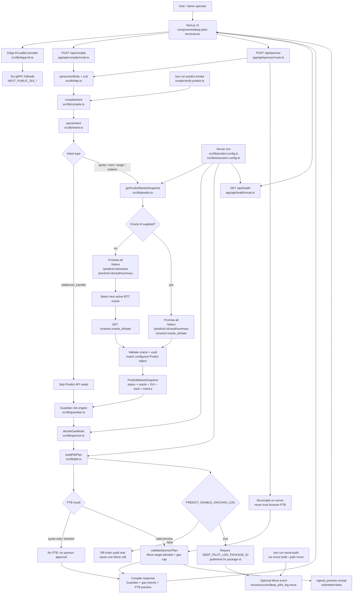

# DeepPilot RiskOps

DeepPilot is a DeepBook Predict execution and risk cockpit for Sui Overflow 2026.

The app turns a constrained trading intent into:

- a live DeepBook Predict market snapshot from `predict-server.testnet.mystenlabs.com`
- a deterministic Guardian decision (`allow`, `reduce`, or `block`)
- an auditable Predict PTB preview
- a sponsor-policy preview for testnet demo flows

## Current Scope

This repository targets DeepBook Predict testnet. It does not pretend to expose a traditional CLOB order book. The risk model uses official Predict primitives:

- Predict server health and pipeline lag
- active BTC oracle state
- latest spot, forward, and SVI data
- oracle freshness and expiry
- vault liquidity, utilization, and max-payout utilization
- ask-bounds when available, with an explicit fallback when the endpoint returns `null`

## How It Works



Key boundaries:

- `/api/compile` is the read and planning path. It returns a live Predict snapshot, Guardian result, sponsor-policy decision, and PTB preview.
- `/api/sponsor` recompiles on the server before producing a preview receipt. It does not trust a PTB returned to the browser.
- `quote-only` intents stop after market and Guardian review. They never build a mint PTB and never receive sponsor approval.
- Real submission is intentionally not hidden behind the preview receipt. A submitted transaction still needs wallet-selected coin inputs, a funded Predict manager, and exact on-chain execution wiring.

The frontend is a single cockpit rather than a generic chat app. `components/deep-pilot-terminal.tsx` owns the intent textarea, market cards, Guardian panel, PTB preview, gas policy checks, and preview receipt. It calls `/api/compile` when the user edits or runs an intent, and calls `/api/sponsor` only after a PTB exists and Guardian has not blocked it. Wallet state is browser-only through DApp Kit; the public RPC URLs use `NEXT_PUBLIC_*` because they are safe to ship to the client.

The backend is deliberately split into small modules. `src/lib/intent.ts` parses a constrained Predict intent and refuses unsafe or incomplete inputs. `src/lib/predict.ts` is the only DeepBook Predict public API reader. `src/lib/guardian.ts` turns live market state into `allow`, `reduce`, or `block`. `src/lib/ptb.ts` builds an auditable PTB preview with exact Move targets, while `src/lib/sponsor.ts` validates gas policy, package allowlists, Move call allowlists, and gas budget. `src/lib/compile.ts` is the orchestrator that wires these pieces together.

Request flow is kept tight. A normal "next active oracle" trade needs three parallel Predict reads first, then one selected oracle-state read. If the user already supplies an oracle id, the app skips the full oracle-list read and performs the remaining three reads in parallel. After direct oracle lookup, the app still checks that the oracle and vault belong to the configured Predict object, so the optimization does not weaken protocol safety.

Environment configuration is split by exposure. `NEXT_PUBLIC_*` values are only for wallet/network client config. Predict package ids, Predict object ids, preview accounts, sponsor limits, and audit-log package ids use normal server-side env names because they are read by API routes and server-side scripts. There is no `NEXT_PRIVATE_*` convention in Next.js; the rule is simply that anything without `NEXT_PUBLIC_` is not bundled into the browser unless the app sends it there.

Gas usage is intentionally conservative. By default `PREDICT_ENABLE_ONCHAIN_LOG=false`, so PTB previews do not add the extra `deep_pilot_log` Move call. If on-chain audit is enabled, `DEEP_PILOT_LOG_PACKAGE_ID` must be a published `0x...` package id; otherwise compile returns a Guardian `CONFIG_ERROR` block instead of creating a misleading PTB.

The current product boundary is also explicit: this app produces live-data PTB previews and sponsor-policy preview receipts, not submitted transactions. That keeps the demo honest until DUSDC funding, PredictManager creation/loading, wallet-selected coin inputs, and final on-chain Move call argument wiring are implemented.

## Commands

```bash
bun install
bun run typecheck
bun run lint
bun run build
bun run predict:smoke
bun run move:build
bun run dev
bun run sui:testnet-key
```

## Environment

Copy `.env.example` to `.env.local` for local development. In Vercel, add the same keys in Project Settings -> Environment Variables.

Use `NEXT_PUBLIC_` only for browser-side wallet/RPC config:

- `NEXT_PUBLIC_SUI_NETWORK`
- `NEXT_PUBLIC_SUI_TESTNET_GRPC_URL`
- `NEXT_PUBLIC_SUI_DEVNET_GRPC_URL`

Use normal server-side env names for DeepBook Predict deployment IDs and package IDs:

- `PREDICT_SERVER_URL`
- `PREDICT_NETWORK`
- `PREDICT_PACKAGE_ID`
- `PREDICT_OBJECT_ID`
- `PREDICT_DUSDC_TYPE`
- `PREDICT_PLP_COIN_TYPE`
- `PREDICT_SOURCE_BRANCH`
- `PREDICT_ENABLE_ONCHAIN_LOG`
- `PREDICT_PREVIEW_SENDER`
- `PREDICT_PREVIEW_SPONSOR`
- `PREDICT_PREVIEW_MANAGER`
- `DEEP_PILOT_LOG_PACKAGE_ID`
- `SPONSOR_MAX_GAS_BUDGET`
- `SPONSOR_MAX_TRADE_SIZE_DUSDC`

Next.js does not need a `NEXT_PRIVATE_` prefix. Anything without `NEXT_PUBLIC_` stays server-side unless you manually send it to the client.

`PREDICT_ENABLE_ONCHAIN_LOG=false` is the default gas-optimized mode. Set it to `true` only for demos that need an extra on-chain audit event.

## Request Strategy

`/api/compile` batches independent Predict reads with `Promise.all`. A free-form "next active oracle" intent needs `/status`, `/oracles`, `/vault/summary`, then one selected `/oracles/:id/state` read. If the intent already includes an oracle id, DeepPilot skips the full oracle list and reads `/status`, `/vault/summary`, and `/oracles/:id/state` in parallel, then validates that the oracle and vault belong to the configured Predict object.

## Important Files

- `.env.example` - Vercel/local deployment configuration template
- `src/lib/predict.ts` - DeepBook Predict public API client and snapshot builder
- `src/lib/predict-config.ts` - server-side Predict deployment config
- `src/lib/client-config.ts` - browser-safe wallet/RPC config
- `src/lib/intent.ts` - deterministic Predict intent parser
- `src/lib/guardian.ts` - pre-sign risk policy
- `src/lib/ptb.ts` - auditable Predict PTB preview
- `src/lib/sponsor.ts` - sponsor gas policy, Move target allowlist, gas budget guard
- `components/deep-pilot-terminal.tsx` - client UI
- `final_proposal.md` - final track proposal and risk review
- `docs/archive/` - original research drafts kept for traceability

## Demo Intent

```text
Buy 10 DUSDC BTC UP near 62500 on the next active DeepBook Predict oracle
```

Real submission still requires a funded testnet Predict manager and DUSDC. The app currently produces a live-data PTB preview and sponsor-policy receipt, not a submitted transaction.
