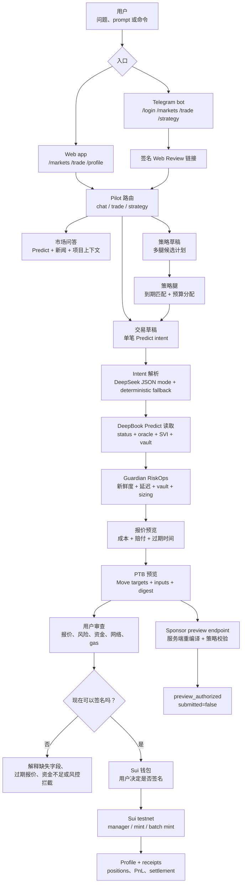

# DeepPilot

[English README](./README.md)

DeepPilot 是面向 DeepBook Predict 的 AI 辅助审查层，用来做更安全的自然语言预测市场交易。用户可以先询问 BTC 市场和新闻，再把一句自然语言，比如“最近结算买 1 DUSDC BTC 跌”，变成交易草稿，检查报价和安全项，最后再决定是否用钱包签名。

它优先服务第一次进入预测市场和链上钱包的新用户。用户不需要一开始就理解 Predict object、oracle 窗口、报价新鲜度、Trading Balance、market key、gas 等细节。DeepPilot 会把这些协议细节翻译成钱包弹出前的可读 review。

## 它为什么诞生

预测市场本身很强，但第一次下单门槛很高。新用户通常会先问几个很自然的问题：

- 今天 BTC 为什么在动？
- 有哪些新闻或市场风险需要理解？
- 买 BTC UP 或 BTC DOWN 到底意味着什么？

到了签名前，用户还必须搞清楚一组协议问题：

- 当前哪个 BTC 预测市场是活跃的？
- 应该选哪个到期时间？
- oracle 是否新鲜，市场是不是已经快过期？
- 这笔仓位会花多少 DUSDC，最大赔付是多少？
- PredictManager 里的 Trading Balance 是否足够？
- 钱包是否在正确的 Sui 网络，是否有足够 gas？
- 这是单笔交易、赎回，还是多腿策略？

DeepPilot 的目标是降低这组操作负担，但不拿走用户控制权。用户可以从 Web 或 Telegram 用自然语言开始，DeepPilot 负责回答市场问题、整理上下文、把明确交易意图转换成受约束的 Predict review、刷新实时市场数据、做确定性的安全检查，然后才进入钱包签名。

## 解决了什么痛点

DeepPilot 解决三个实际痛点：

- 新手上手难：用户可以用 AI 问 BTC 市场，也可以用自然语言生成交易草稿，不需要手动拼 oracle id、expiry、market key 和交易参数。
- 签名前信息不清楚：每笔交易或策略都会先展示 outcome、amount、expiry、报价估算、Guardian 决策、Trading Balance、钱包网络和 gas readiness。
- Web 与 Telegram 割裂：用户可以在 Telegram 里开始，通过 Web Review 链接进入浏览器，并在钱包确认前重新刷新报价和安全检查。

## 用户可以做什么

- 在 `/trade` 用自然语言提问；DeepPilot 可以回答市场、新闻或项目上下文问题，而不是把所有消息都强行当成交易。
- 在 `/markets` 浏览实时 BTC Predict 市场，按到期时间筛选，查看快速风险标签、vault 信息和历史图表。
- 用自然语言发起单笔交易，例如：`Bet 1 DUSDC on BTC DOWN at the nearest settlement`。
- 用自然语言生成多腿策略，例如：`Build a 1 DUSDC hedge strategy mostly BTC UP at the nearest settlement`。
- 在签名前查看 Guardian 结果：`allow`、`reduce` 或 `block`，并看到人能读懂的原因。
- 创建或关联 PredictManager，检查 Trading Balance，并对支持的交易路径进行钱包签名。
- 使用 Telegram 命令：`/login`、`/markets`、`/news BTC`、`/trade ...`、`/strategy ...`，从聊天入口进入 Web Review。
- 在 `/profile` 跟踪本地 receipts、manager 状态、Trading Balance、positions、PnL、settlement 状态，以及 redeem/funding 操作。

## 给用户带来的好处

对第一次使用预测市场的人来说，DeepPilot 把体验从“先学完协议再下单”变成“先问问题、理解上下文，再审查生成的交易草稿”。用户仍然自己做交易决策，也仍然自己控制钱包签名，但协议里容易出错的部分会被拆成可读检查。

对熟悉预测市场的用户来说，DeepPilot 减少重复操作：市场发现、报价刷新、策略腿构造、钱包预检查、receipt 追踪都在同一个流程里完成。

## 当前产品范围

| 模块 | 已实现 | 边界 |
| --- | --- | --- |
| 市场发现 | 实时 BTC DeepBook Predict 市场、到期筛选、图表历史、页面级风险标签 | 不伪装成传统 CLOB order book。 |
| 自然语言交易 | Web 和 Telegram 输入会被路由到 `chat`、`trade` 或 `strategy` | AI 输出会被校验，也有确定性 fallback；AI 输出不会被当成直接执行。 |
| 单笔交易审查 | 实时 Predict snapshot、Guardian、quote preview、PTB preview、资金检查 | quote-only intent 不会构造交易；报价只是估算，不承诺收益。 |
| 策略审查 | 确定性多腿策略、逐腿编译、聚合资金检查、批量交易预览 | 策略输出是候选计划，不是投资建议。 |
| 钱包执行 | 通过用户钱包创建 PredictManager、单笔 binary mint、已选策略 batch mint | 签名始终由用户控制。 |
| Sponsor endpoint | challenge、钱包授权、服务端重编译、策略校验、preview receipt | `/api/sponsor` 仍是 preview-only，返回 `submitted: false`，不做 dual-sign sponsor 提交。 |
| Telegram handoff | 登录/绑定、quota、市场/新闻/交易/策略命令、签名 Web Review 链接 | 真正执行仍在 Web 钱包确认中完成。 |
| Profile | Manager 关联、Trading Balance、positions、PnL、settlement/redeem/funding UI、本地 receipts | 没有关联 manager 时保持空状态，不虚构仓位或 PnL。 |

## 技术实现流程



### 文字版流程

1. 用户从 Web 或 Telegram 输入市场问题、交易请求或策略请求。
2. Pilot router 将输入分类为 chat、trade 或 strategy。
3. chat 请求会返回 Predict/新闻上下文；trade 和 strategy 会被转换成受约束的 Predict review。LLM 输出按不可信输入处理，必须校验；没有 LLM key 时也可以走确定性 fallback。
4. DeepPilot 读取 DeepBook Predict 的 status、活跃 BTC oracles、oracle state、SVI 数据和 vault summary。
5. Guardian 判断本次 review 是否允许继续、需要缩小，还是必须阻断。
6. 如果动作需要开仓，DeepPilot 会请求 quote，并生成包含准确 Move target 和输入参数的 PTB preview。
7. 签名前，Web app 会从 typed intent 或 strategy plan 刷新报价敏感信息，并检查钱包网络、SUI gas、PredictManager 和 Trading Balance，避免重新跑一次 AI 解析。
8. 支持的动作可以由用户钱包签名，用户也可以拒绝钱包弹窗。Sponsor 授权仍然只是 preview 路径。
9. `/profile` 会展示 manager 状态、receipts、positions、PnL、funding、withdrawal、redeem 和 settlement 信息。

## 主要页面

- `/landing` - 给评委和用户看的产品页。
- `/markets` - 实时 BTC Predict 市场发现和图表查看。
- `/trade` - 自然语言问答、交易审查、策略审查和钱包签名工作台。
- `/profile` - 钱包 profile、PredictManager、Trading Balance、positions、receipts 和 settlement 操作。
- `/telegram/login` - Telegram 用户的钱包绑定和 Profile NFT onboarding。

## API Surface

- `POST /api/pilot/stream` - chat、trade、strategy 的统一流式入口。
- `POST /api/compile` - 将单笔 Predict intent 编译成 market、Guardian、quote、gas 和 PTB review；刷新 review 时可以复用 typed intent，避免重新跑 AI 解析。
- `POST /api/compile/stream` - 单笔交易编译的流式版本。
- `POST /api/strategy/compile` - 编译多腿策略 review。
- `POST /api/strategy/stream` - 策略 review 的流式版本。
- `GET /api/markets` - 分页市场发现。
- `GET /api/oracles/:id/history` - 选中 oracle 的有界图表/历史数据。
- `GET /api/profile` - 钱包和 PredictManager summary。
- `GET /api/review-seed` - 解码 Telegram/Web Review replay token。
- `GET /api/sponsor` 和 `POST /api/sponsor` - sponsor challenge 与 preview authorization。
- `GET /api/health` - 运行时健康检查。

## 实现说明

- `src/lib/pilot.ts` 将用户输入分类为 `chat`、`trade` 或 `strategy`。
- `src/lib/intent.ts` 用 DeepSeek JSON mode 和确定性 fallback 解析单笔交易意图。
- `src/lib/strategy.ts` 构造策略腿、逐腿编译，并生成批量执行 readiness。
- `src/lib/predict.ts` 是唯一的 DeepBook Predict public API reader；响应会做 schema 校验和 timeout 约束。
- `src/lib/guardian.ts` 将实时市场状态转换成 `allow`、`reduce` 或 `block` 决策。
- `src/lib/compile.ts` 编排 intent parsing、Predict reads、Guardian、quote、PTB 和 gas checks；刷新 review 时可以复用 typed intent，避免签名前再次等待 AI。
- `src/lib/ptb.ts` 构造可审计 PTB preview，包含准确 Move target、object id 和 command input。
- `src/lib/predict-execution.ts` 为支持的 manager、mint、batch mint、funding、withdrawal 和 redeem 动作构造钱包可签名 Sui transaction。
- `src/lib/sponsor.ts` 校验 gas policy、package allowlist、Move call allowlist 和 trade-size cap。
- `src/lib/telegram-bot.ts` 处理 Telegram 命令、quota、memory context、review link、trade review 和 strategy review。
- `components/deep-pilot-terminal.tsx` 是主要审查和签名工作台。
- `components/markets-page.tsx` 和 `components/market-data-provider.tsx` 负责市场发现和短生命周期客户端缓存。
- `components/profile-page.tsx` 负责 manager、Trading Balance、positions、receipts 和 settlement UX。

## 命令

```bash
bun install
bun run dev
bun run typecheck
bun run lint
bun run build
bun run pilot:smoke
bun run predict:smoke
bun run telegram:smoke
bun run move:build
bun run telegram:set-webhook
bun run sui:testnet-key
```

只有在 `APP_BASE_URL`、`TELEGRAM_BOT_TOKEN` 和 `TELEGRAM_WEBHOOK_SECRET` 都配置好之后，才运行 `bun run telegram:set-webhook`。

## 环境变量

本地开发先复制 `.env.example` 到 `.env.local`。在 Vercel 上，把同样的 key 配到 Project Settings -> Environment Variables。

浏览器安全的钱包/RPC 配置使用 `NEXT_PUBLIC_*`：

- `NEXT_PUBLIC_SUI_NETWORK`
- `NEXT_PUBLIC_SUI_TESTNET_GRPC_URL`
- `NEXT_PUBLIC_SUI_DEVNET_GRPC_URL`

Predict、执行、sponsor、Telegram、quota、profile 和可选 memory 配置使用普通服务端 env 名：

- `PREDICT_SERVER_URL`
- `PREDICT_NETWORK`
- `PREDICT_PACKAGE_ID`
- `PREDICT_OBJECT_ID`
- `PREDICT_DUSDC_TYPE`
- `PREDICT_PLP_COIN_TYPE`
- `PREDICT_SOURCE_BRANCH`
- `PREDICT_ENABLE_ONCHAIN_LOG`
- `PREDICT_PREVIEW_SENDER`
- `PREDICT_PREVIEW_SPONSOR`
- `PREDICT_PREVIEW_MANAGER`
- `DEEP_PILOT_LOG_PACKAGE_ID`
- `REVIEW_SEED_SECRET`
- `SPONSOR_MAX_GAS_BUDGET`
- `SPONSOR_MAX_TRADE_SIZE_DUSDC`
- `DEEPSEEK_API_KEY`
- `DEEPSEEK_MODEL`
- `APP_BASE_URL`
- `TELEGRAM_BOT_TOKEN`
- `TELEGRAM_WEBHOOK_SECRET`
- `TELEGRAM_LINK_SECRET`
- `TELEGRAM_LINK_SALT`
- `UPSTASH_REDIS_REST_URL`
- `UPSTASH_REDIS_REST_TOKEN`
- `DEEP_PILOT_PROFILE_PACKAGE_ID`
- `DEEP_PILOT_PROFILE_REGISTRY_ID`
- `DEEP_PILOT_PROFILE_TREASURY_ID`
- `PLAN_PRICE_MIST`
- `PLAN_DURATION_DAYS`
- `QUOTA_V1_DAILY_LIMIT`
- `MEMWAL_ACCOUNT_ID`
- `MEMWAL_DELEGATE_KEY`
- `MEMWAL_SERVER_URL`

Next.js 没有 `NEXT_PRIVATE_*` 约定。没有 `NEXT_PUBLIC_` 前缀的变量默认留在服务端，除非应用主动把它发给浏览器。

## Demo Intents

```text
What is moving BTC today?
Bet 1 DUSDC on BTC DOWN at the nearest settlement
Build a 1 DUSDC hedge strategy, mostly BTC UP, nearest settlement
Split 1 DUSDC BTC UP across nearest, 1h, and 2h expiries
Redeem my settled BTC DOWN position
```

## 重要边界

DeepPilot 帮助用户理解、审查和签名 DeepBook Predict 动作。它不是投资建议，不承诺收益，也不会替用户做交易决策或签名交易。
